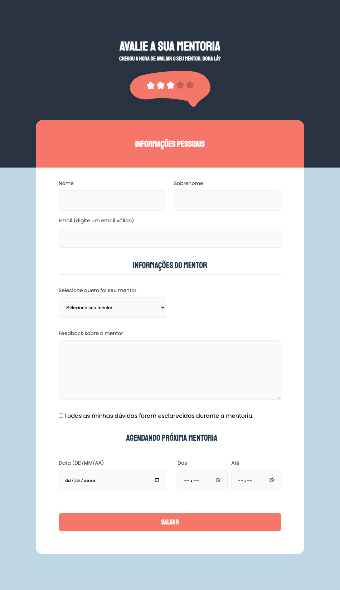

<h1 align="center">
  Avaliação da mentoria ✅
</h1>

  <a href="#-tecnologias">Tecnologias</a>&nbsp;&nbsp;&nbsp;|&nbsp;&nbsp;&nbsp;
  <a href="#-projeto">Projeto</a>&nbsp;&nbsp;&nbsp;|&nbsp;&nbsp;&nbsp;
  <a href="#-layout">Layout</a>&nbsp;&nbsp;&nbsp;|&nbsp;&nbsp;&nbsp;
  <a href="#memo-licença">Licença</a>

  

## 🚀 Tecnologias

Esse projeto foi desenvolvido com as seguintes tecnologias:

- HTML
- CSS

## 💻 Projeto

Formulário desenvolvido para avaliação das aulas de mentoria

## 🔖 Layout

Você pode visualizar o layout do projeto através [desse link](https://www.figma.com/file/fnZyJHs7eqNFAA7tUrKcsD/Stage-03---Formulário-avançado?node-id=0%3A1&t=0wIE5kpyarA6WIaV-0). É necessário ter conta no [Figma](https://figma.com) para acessá-lo.

## :memo: Licença

Esse projeto está sob a licença MIT. Veja o arquivo [LICENSE](LICENSE.md) para mais detalhes.

---

Feito por Alan Rehfeldt :wave: 
